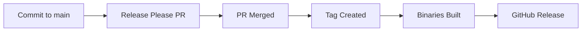

# gh-wizard 🔮

A magical GitHub CLI extension that creates repositories using template repositories with an intuitive, create-next-app style interface.

[](https://github.com/Yuki-Sakaguchi/gh-wizard/releases)

## ✨ Features

- 🎨 **Beautiful create-next-app style UI** - Interactive, step-by-step project creation
- 📦 **Template Repository Support** - Automatically discovers your template repositories
- 🖥️ **Terminal-Optimized Display** - Dynamically adapts to your terminal width with CJK character support
- ⚡ **Fast Installation** - Single command installation via GitHub CLI
- 🌍 **Cross-Platform** - Works on macOS, Linux, and Windows
- 🎯 **Zero Configuration** - Works out of the box with your GitHub account

## 🚀 Quick Start

### Installation

```bash
gh extension install Yuki-Sakaguchi/gh-wizard
```

### Basic Usage

```bash
# Start the interactive wizard
gh wizard

# Use classic multi-question UI
gh wizard --classic-ui

# Non-interactive mode
gh wizard --name my-project --template user/template-repo

# Dry run mode (preview only)
gh wizard --name my-project --dry-run
```

## 🎯 Usage Examples

### Interactive Mode (Default)

The default mode provides a beautiful, create-next-app inspired interface:

```bash
$ gh wizard

🔍 Fetching your template repositories...
✅ Found 3 template repositories

? Please select a template: [Use arrows to move, type to filter]
> nextjs-starter - Next.js project starter kit with TypeScript
  node-ts - TypeScript Node.js development environment
  react-component - Reusable React component template

✓ Please select a template: … nextjs-starter
✓ What is your project named? … my-awesome-app
✓ Enter project description (optional): … My awesome new project
✓ Create repository on GitHub? … Yes
✓ Create as private repository? … No

📝 Configuration Review
✓ Project Name: my-awesome-app
✓ Description:  My awesome new project
✓ Template:     nextjs-starter (15⭐)
✓ Local Path:   ./my-awesome-app
✓ Private:      False

? Create project with this configuration? (y/N) 
```

### Command Line Options

| Option | Short | Description | Example |
|--------|-------|-------------|---------|
| `--name` | `-n` | Project name (required for non-interactive) | `--name my-project` |
| `--template` | `-t` | Template to use | `--template user/repo` |
| `--dry-run` | | Preview configuration without creating | `--dry-run` |
| `--yes` | `-y` | Skip all confirmations | `--yes` |
| `--classic-ui` | | Use classic multi-question UI | `--classic-ui` |

### Advanced Examples

```bash
# Create project with specific template
gh wizard --name my-api --template myorg/fastapi-template --yes

# Preview what would be created
gh wizard --name test-project --template user/template --dry-run

# Use classic UI for batch operations
gh wizard --classic-ui --name batch-project
```

## 🔧 How It Works

1. **Template Discovery**: Automatically finds repositories marked as "Template repository" in your GitHub account
2. **Interactive Selection**: Choose from your templates with rich descriptions and metadata
3. **Project Configuration**: Set up project name, description, and GitHub repository options
4. **Smart Creation**: 
   - Clones template repository
   - Creates local project directory
   - Initializes new Git repository
   - Optionally creates GitHub repository
   - Handles file templating and variable replacement

## 📋 Prerequisites

- [GitHub CLI](https://cli.github.com/) installed and authenticated
- Git installed
- Go 1.21+ (for development)

## 🛠️ Development

### Local Development

```bash
# Clone the repository
git clone https://github.com/Yuki-Sakaguchi/gh-wizard.git
cd gh-wizard

# Install dependencies
go mod tidy

# Build the project
go build

# Run tests
go test ./...

# Install locally for testing
gh extension install .
```

### Testing

```bash
# Run all tests
go test ./...

# Run tests with coverage
go test -cover ./...

# Run specific test package
go test ./internal/wizard/...
```

## 🎨 UI Features

### Create-Next-App Style Interface

- **Progressive Disclosure**: One question at a time for better focus
- **Visual Feedback**: Checkmarks show completed steps
- **Smart Defaults**: Sensible defaults for common workflows
- **Error Handling**: Clear, actionable error messages

### Terminal Optimization

- **Dynamic Width Adaptation**: Automatically adjusts to your terminal size
- **CJK Character Support**: Proper handling of Japanese, Chinese, and Korean characters
- **Responsive Layout**: Works well on both narrow and wide terminals
- **Accessibility**: Screen reader friendly output

## 📚 Template Repository Setup

To make your repositories discoverable by gh-wizard:

1. Go to your repository on GitHub
2. Navigate to Settings → General
3. Check "Template repository" under Repository template
4. Add descriptive topics for better categorization

## 🚀 Release Automation

This project uses automated semantic versioning and releases powered by [Release Please](https://github.com/googleapis/release-please).

### How It Works

1. **Conventional Commits**: All commits must follow [Conventional Commits](https://www.conventionalcommits.org/) format
2. **Automatic Versioning**: Version bumps are determined by commit types:
   - `feat:` → Minor version bump (1.0.0 → 1.1.0)
   - `fix:` → Patch version bump (1.0.0 → 1.0.1) 
   - `feat!:` or `BREAKING CHANGE:` → Major version bump (1.0.0 → 2.0.0)
3. **Release PR Creation**: When commits are pushed to main, Release Please creates a release PR
4. **Automated Release**: When the release PR is merged, a new release is automatically created with:
   - Updated CHANGELOG.md
   - Git tag creation
   - Cross-platform binary builds
   - GitHub release publication

### Release Workflow



### Manual Releases (Backward Compatible)

You can still create manual releases by pushing tags:

```bash
git tag v1.2.3
git push origin v1.2.3
```

## 🤝 Contributing

We welcome contributions! Please see our [Contributing Guide](CONTRIBUTING.md) for details.

### Quick Contribution Steps

1. Fork the repository
2. Create a feature branch (`git checkout -b feature/amazing-feature`)
3. Make your changes
4. Add tests for your changes
5. Run tests (`go test ./...`)
6. Commit using [Conventional Commits](https://www.conventionalcommits.org/) format
7. Push and create a Pull Request

## 📄 License

This project is licensed under the MIT License - see the [LICENSE](LICENSE) file for details.

## 🙏 Acknowledgments

- Inspired by [create-next-app](https://nextjs.org/docs/api-reference/create-next-app) and [create-react-app](https://create-react-app.dev/)
- Built with [GitHub CLI](https://cli.github.com/) and [go-gh](https://github.com/cli/go-gh)
- UI powered by [survey](https://github.com/AlecAivazis/survey) with custom enhancements

## 🐛 Issues & Support

- 🐞 [Report bugs](https://github.com/Yuki-Sakaguchi/gh-wizard/issues/new?template=bug_report.md)
- 💡 [Request features](https://github.com/Yuki-Sakaguchi/gh-wizard/issues/new?template=feature_request.md)
- 💬 [Ask questions](https://github.com/Yuki-Sakaguchi/gh-wizard/discussions)

---

<p align="center">
  Made with ❤️ for the GitHub community
</p>
