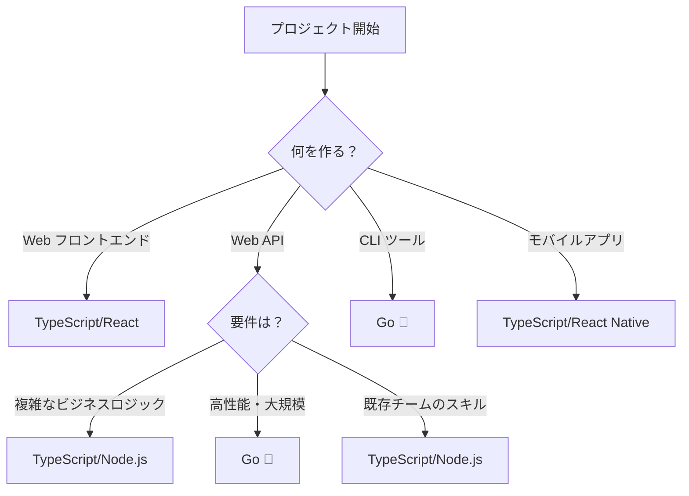

# Go言語 完全ガイド（TypeScript経験者向け）

## 1. 🚀 Goの特徴・他言語との違い

### 1.1 Goが生まれた理由
Googleが2009年に開発。**「シンプルで高速で安全」**な言語を目指した。

```
問題: C++は複雑、Pythonは遅い、Javaは冗長
解決: Goはシンプル + 高速 + 並行処理が得意
```

### 1.2 他言語との比較

| 特徴 | Go | TypeScript | Java | Node.js |
|------|----|-----------|----- |---------|
| **コンパイル** | ✅ 静的コンパイル | ❌ トランスパイル | ✅ バイトコード | ❌ インタープリター |
| **起動速度** | ⚡ 超高速 | 🐌 遅い | 🐌 遅い | 🏃 普通 |
| **メモリ使用量** | 💾 少ない | 💾💾 多い | 💾💾💾 非常に多い | 💾💾 多い |
| **並行処理** | 🎯 goroutine | ⚙️ async/await | 🧵 Thread | ⚙️ async/await |
| **学習コストN** | 📚 低い | 📚📚 中程度 | 📚📚📚 高い | 📚 低い |

### 1.3 Goの革新的な特徴

#### 🎯 **1. Goroutine（軽量スレッド）**
```typescript
// TypeScript - 重いPromise
async function fetchData() {
    const results = await Promise.all([
        fetch('/api/user'),
        fetch('/api/posts'),
        fetch('/api/comments')
    ]);
    return results;
}
```

```go
// Go - 軽量goroutine
func fetchData() {
    userCh := make(chan User)
    postsCh := make(chan []Post)
    
    go func() { userCh <- fetchUser() }()     // 軽量スレッド！
    go func() { postsCh <- fetchPosts() }()  // 軽量スレッド！
    
    user := <-userCh
    posts := <-postsCh
}
```

#### 🧩 **2. インターフェースの暗黙的実装**
```typescript
// TypeScript - 明示的実装
interface Writer {
    write(data: string): void;
}

class FileWriter implements Writer {  // implements必要
    write(data: string) { /* */ }
}
```

```go
// Go - 暗黙的実装（Duck Typing）
type Writer interface {
    Write([]byte) (int, error)
}

type FileWriter struct{}

func (f FileWriter) Write(data []byte) (int, error) {
    // この時点で自動的にWriterインターフェースを満たす！
    return len(data), nil
}
```

#### ⚡ **3. 爆速コンパイル + 単一バイナリ**
```bash
# TypeScript
npm run build  # 10-30秒
node dist/app.js

# Go
go build      # 1-3秒
./app         # 依存関係なしで動く！
```

### 1.4 Goを選ぶべき理由

#### ✅ **こんな場合はGo一択**
- **CLI ツール**: 単一バイナリで配布したい
- **マイクロサービス**: 軽量で高速なAPI
- **インフラツール**: Docker, Kubernetes, Terraformなど
- **高並行処理**: 数万の同時接続を処理

#### 📊 **実際の採用例**
- **Docker**: コンテナ技術の基盤
- **Kubernetes**: オーケストレーション
- **GitHub CLI**: 我々が使っているツール！
- **Terraform**: インフラ管理
- **Prometheus**: 監視システム

### 1.5 GoとTypeScriptの使い分け



---

## 2. 🔧 環境構築

### 2.1 Go インストール

#### **macOS**
```bash
# Homebrew（推奨）
brew install go

# 公式インストーラー
# https://golang.org/dl/ からダウンロード
```

#### **Windows**
```bash
# Chocolatey
choco install golang

# Scoop
scoop install go

# 公式インストーラー
# https://golang.org/dl/ からダウンロード
```

#### **Linux**
```bash
# Ubuntu/Debian
sudo apt update
sudo apt install golang-go

# 公式バイナリ（推奨）
wget https://golang.org/dl/go1.21.0.linux-amd64.tar.gz
sudo tar -C /usr/local -xzf go1.21.0.linux-amd64.tar.gz
export PATH=$PATH:/usr/local/go/bin
```

### 2.2 バージョン管理

#### **g（Goのnvm的なツール）**
```bash
# インストール
curl -sSL https://git.io/g-install | sh -s

# 使用方法
g install 1.21.0    # 特定バージョンインストール
g use 1.21.0        # バージョン切り替え
g list              # インストール済みバージョン一覧
```

#### **gvm（Go Version Manager）**
```bash
# インストール
bash < <(curl -s -S -L https://raw.githubusercontent.com/moovweb/gvm/master/binscripts/gvm-installer)

# 使用方法
gvm install go1.21.0
gvm use go1.21.0 --default
```

### 2.3 環境変数設定

```bash
# ~/.bashrc または ~/.zshrc に追加
export GOPATH=$HOME/go           # ワークスペース（Go 1.11以降は不要）
export GOROOT=/usr/local/go      # Goインストール先
export PATH=$PATH:$GOROOT/bin    # go コマンドのパス
export PATH=$PATH:$GOPATH/bin    # go install したツールのパス

# 設定確認
go version
go env GOROOT
go env GOPATH
```

### 2.4 プロジェクト・ライブラリ管理

#### **Go Modules（package.jsonの代替）**

```bash
# 新規プロジェクト作成（npm initに相当）
mkdir myproject
cd myproject
go mod init github.com/username/myproject

# 依存関係追加（npm installに相当）
go get github.com/gin-gonic/gin
go get github.com/spf13/cobra@v1.7.0  # バージョン指定

# 依存関係更新
go mod tidy     # 不要な依存関係を削除（npm pruneに相当）
go mod download # 依存関係をダウンロード
```

#### **go.mod ファイル（package.jsonに相当）**
```go
module github.com/username/myproject

go 1.21

require (
    github.com/gin-gonic/gin v1.9.1
    github.com/spf13/cobra v1.7.0
)

replace github.com/some/package => ./local/package  // ローカル開発用
```

#### **よく使うライブラリ**
```bash
# Web フレームワーク
go get github.com/gin-gonic/gin           # Express.js的
go get github.com/gofiber/fiber/v2        # Fastify的

# CLI ツール
go get github.com/spf13/cobra             # CLI構築
go get github.com/charmbracelet/bubbletea # TUI構築

# データベース
go get gorm.io/gorm                       # ORM
go get github.com/lib/pq                  # PostgreSQL

# ユーティリティ
go get github.com/stretchr/testify        # テスト
go get github.com/sirupsen/logrus         # ログ
```

### 2.5 開発環境（VSCode）

#### **必須拡張機能**
```json
{
    "recommendations": [
        "golang.go",                    // Go 公式拡張
        "ms-vscode.vscode-go",         // Go サポート
        "github.copilot",              // AI アシスタント
        "bradlc.vscode-tailwindcss"    // 今回は不要だが参考まで
    ]
}
```

#### **VSCode設定（settings.json）**
```json
{
    "go.useLanguageServer": true,
    "go.formatTool": "goimports",
    "go.lintTool": "golangci-lint",
    "go.testFlags": ["-v"],
    "go.testTimeout": "30s",
    "[go]": {
        "editor.insertSpaces": false,  // タブ文字使用（Go標準）
        "editor.formatOnSave": true,
        "editor.codeActionsOnSave": {
            "source.organizeImports": true
        }
    }
}
```

#### **有用なツールのインストール**
```bash
# コード フォーマッター
go install golang.org/x/tools/cmd/goimports@latest

# リンター
go install github.com/golangci/golangci-lint/cmd/golangci-lint@latest

# テストツール
go install gotest.tools/gotestsum@latest

# ライブリロード
go install github.com/cosmtrek/air@latest
```

---

## 3. 📚 基礎（TypeScript比較 + Go慣例）

### 3.1 プロジェクト構造（慣例）

```
myproject/
├── cmd/                    # メインアプリケーション
│   └── myapp/
│       └── main.go
├── internal/               # プライベートコード（重要！）
│   ├── handler/
│   ├── service/
│   └── model/
├── pkg/                    # 他プロジェクトから使用可能
│   └── utils/
├── api/                    # API定義
├── web/                    # Web資産
├── scripts/                # スクリプト
├── test/                   # テスト
├── go.mod
├── go.sum
├── README.md
└── Makefile
```

### 3.2 命名規則（Go慣例）

#### **🔤 大文字・小文字の重要性**
```go
// Public（他パッケージから参照可能）
type User struct {
    Name  string  // Public field
    Email string  // Public field
}

func (u User) GetName() string {  // Public method
    return u.name
}

// Private（同一パッケージ内のみ）
type user struct {
    name  string  // private field
    email string  // private field
}

func (u user) getName() string {  // private method
    return u.name
}
```

#### **📝 変数・関数の命名**
```go
// TypeScript style（NG）
const userName = "john";
const userAge = 25;
const isUserActive = true;

// Go style
var userName string = "john"      // OK: camelCase
var userAge int = 25              // OK
var isUserActive bool = true      // OK、ただし...

// より Go らしい書き方
var (
    userName     = "john"         // 型推論
    userAge      = 25
    userActive   = true           // "is" は冗長
)

// 短縮形を好む文化
var (
    u    User        // user より u
    ctx  context.Context  // context より ctx
    err  error       // error は必ず err
    i, j int         // loop index
)
```

#### **🏷️ 定数・エラー**
```go
// 定数は大文字スネークケース
const (
    MAX_RETRY_COUNT = 3
    DEFAULT_TIMEOUT = 30 * time.Second
)

// または、グループ化
const (
    StatusOK       = 200
    StatusNotFound = 404
    StatusError    = 500
)

// エラーは "Err" プレフィックス
var (
    ErrUserNotFound = errors.New("user not found")
    ErrInvalidInput = errors.New("invalid input")
)
```

### 3.3 基本構文（TypeScript対比）

#### **変数宣言**
```typescript
// TypeScript
let name: string = "John";
const age: number = 25;
let active: boolean;
```

```go
// Go - 複数の書き方
var name string = "John"    // 明示的
var age = 25                // 型推論
var active bool             // ゼロ値（false）

// 短縮宣言（関数内のみ）
name := "John"              // 最も Go らしい
age := 25
```

#### **関数**
```typescript
// TypeScript
function add(a: number, b: number): number {
    return a + b;
}

const multiply = (a: number, b: number): number => a * b;
```

```go
// Go
func add(a, b int) int {        // 同じ型は省略可能
    return a + b
}

// 複数戻り値（Goの特徴！）
func divmod(a, b int) (int, int) {
    return a / b, a % b
}

// 名前付き戻り値（Go慣例）
func divide(a, b int) (result int, err error) {
    if b == 0 {
        err = errors.New("division by zero")
        return  // result=0, err=errors.New(...) が返される
    }
    result = a / b
    return
}
```

#### **構造体（TypeScriptのinterfaceに相当）**
```typescript
// TypeScript
interface User {
    id: number;
    name: string;
    email?: string;  // オプショナル
    readonly createdAt: Date;
}
```

```go
// Go
type User struct {
    ID        int       `json:"id"`         // JSONタグ
    Name      string    `json:"name"`
    Email     *string   `json:"email,omitempty"`  // ポインタでオプショナル
    CreatedAt time.Time `json:"created_at"`
}

// Goらしいコンストラクタ
func NewUser(id int, name string) *User {
    return &User{
        ID:        id,
        Name:      name,
        CreatedAt: time.Now(),
    }
}
```

### 3.4 エラーハンドリング（Go流）

```typescript
// TypeScript
try {
    const user = await getUser(id);
    console.log(user.name);
} catch (error) {
    console.error('Error:', error);
}
```

```go
// Go - エラーは戻り値
user, err := getUser(id)
if err != nil {
    log.Printf("Error: %v", err)  // %v は型に関係なく値を表示
    return
}
fmt.Println(user.Name)

// Go慣例: 早期リターン
func processUser(id int) error {
    user, err := getUser(id)
    if err != nil {
        return err  // エラーをそのまま返す
    }
    
    if err := validateUser(user); err != nil {
        return fmt.Errorf("validation failed: %w", err)  // エラーラップ
    }
    
    // 成功パスは最後
    return saveUser(user)
}
```

### 3.5 並行処理（Go流）

```typescript
// TypeScript
const results = await Promise.all([
    fetchUser(1),
    fetchUser(2), 
    fetchUser(3)
]);
```

```go
// Go - Goroutine + Channel
func fetchUsers(ids []int) []User {
    userCh := make(chan User, len(ids))
    
    // 並行実行
    for _, id := range ids {
        go func(id int) {           // クロージャ
            user, _ := fetchUser(id)
            userCh <- user
        }(id)  // 重要: id を渡す
    }
    
    // 結果収集
    var users []User
    for i := 0; i < len(ids); i++ {
        users = append(users, <-userCh)
    }
    
    return users
}
```

### 3.6 Go流のイディオム

#### **ゼロ値の活用**
```go
// Go では明示的な初期化が不要
var (
    count   int     // 0
    message string  // ""
    active  bool    // false
    users   []User  // nil（空スライス）
)

// nilチェック
if users == nil {
    users = make([]User, 0)  // 初期化
}
```

#### **short variable declaration の使い分け**
```go
// 関数外ではvar
var GlobalConfig Config

func processData() {
    // 関数内では := を好む
    data := make([]byte, 1024)
    count := 0
    
    // 既存変数に代入する場合は =
    count = len(data)
}
```

#### **interface{} よりも型安全を**
```go
// 古いGo（避ける）
func process(data interface{}) {
    // 型アサーション必要
}

// 現代のGo（推奨）
func process[T any](data T) {
    // ジェネリクス使用
}
```

---

## 4. 🛠️ 軽く何か作ってみる

### 4.1 プロジェクト: GitHub スター チェッカー

**やること**: GitHub APIを使って、リポジトリのスター数を取得するCLIツール

#### **プロジェクト作成**
```bash
mkdir star-checker
cd star-checker
go mod init github.com/your-username/star-checker
```

#### **基本構造を作成**
```go
// main.go
package main

import (
    "encoding/json"
    "fmt"
    "net/http"
    "os"
    "strings"
)

// GitHub API のレスポンス
type Repository struct {
    Name            string `json:"name"`
    FullName        string `json:"full_name"`
    Description     string `json:"description"`
    StargazersCount int    `json:"stargazers_count"`
    ForksCount      int    `json:"forks_count"`
    Language        string `json:"language"`
}

// GitHub API からリポジトリ情報を取得
func fetchRepository(owner, repo string) (*Repository, error) {
    url := fmt.Sprintf("https://api.github.com/repos/%s/%s", owner, repo)
    
    resp, err := http.Get(url)
    if err != nil {
        return nil, fmt.Errorf("HTTP request failed: %w", err)
    }
    defer resp.Body.Close()
    
    if resp.StatusCode != 200 {
        return nil, fmt.Errorf("API returned status %d", resp.StatusCode)
    }
    
    var repository Repository
    if err := json.NewDecoder(resp.Body).Decode(&repository); err != nil {
        return nil, fmt.Errorf("JSON decode failed: %w", err)
    }
    
    return &repository, nil
}

// メイン処理
func main() {
    if len(os.Args) < 2 {
        fmt.Println("Usage: star-checker <owner/repo>")
        fmt.Println("Example: star-checker microsoft/vscode")
        os.Exit(1)
    }
    
    // コマンドライン引数から owner/repo を分離
    parts := strings.Split(os.Args[1], "/")
    if len(parts) != 2 {
        fmt.Println("Error: Please specify repository as 'owner/repo'")
        os.Exit(1)
    }
    
    owner, repo := parts[0], parts[1]
    
    // GitHub API からデータ取得
    fmt.Printf("Fetching data for %s/%s...\n", owner, repo)
    
    repository, err := fetchRepository(owner, repo)
    if err != nil {
        fmt.Printf("Error: %v\n", err)
        os.Exit(1)
    }
    
    // 結果表示
    fmt.Printf("\n🎉 Repository: %s\n", repository.FullName)
    fmt.Printf("📄 Description: %s\n", repository.Description)
    fmt.Printf("⭐ Stars: %d\n", repository.StargazersCount)
    fmt.Printf("🍴 Forks: %d\n", repository.ForksCount)
    fmt.Printf("💻 Language: %s\n", repository.Language)
}
```

#### **実行してみる**
```bash
# ビルド & 実行
go run main.go microsoft/vscode
go run main.go golang/go
go run main.go facebook/react

# バイナリ作成
go build -o star-checker
./star-checker torvalds/linux
```

### 4.2 改良版: 複数リポジトリの並行取得

```go
// improved/main.go
package main

import (
    "encoding/json"
    "fmt"
    "net/http"
    "os"
    "strings"
    "sync"
)

type Repository struct {
    Name            string `json:"name"`
    FullName        string `json:"full_name"`
    Description     string `json:"description"`
    StargazersCount int    `json:"stargazers_count"`
    ForksCount      int    `json:"forks_count"`
    Language        string `json:"language"`
}

// 結果を格納する構造体
type Result struct {
    Repository *Repository
    Error      error
}

func fetchRepository(owner, repo string) (*Repository, error) {
    url := fmt.Sprintf("https://api.github.com/repos/%s/%s", owner, repo)
    
    resp, err := http.Get(url)
    if err != nil {
        return nil, fmt.Errorf("HTTP request failed: %w", err)
    }
    defer resp.Body.Close()
    
    if resp.StatusCode != 200 {
        return nil, fmt.Errorf("API returned status %d", resp.StatusCode)
    }
    
    var repository Repository
    if err := json.NewDecoder(resp.Body).Decode(&repository); err != nil {
        return nil, fmt.Errorf("JSON decode failed: %w", err)
    }
    
    return &repository, nil
}

// 並行処理で複数リポジトリを取得
func fetchRepositories(repoSpecs []string) []Result {
    results := make([]Result, len(repoSpecs))
    var wg sync.WaitGroup
    
    for i, repoSpec := range repoSpecs {
        wg.Add(1)
        
        go func(index int, spec string) {
            defer wg.Done()
            
            parts := strings.Split(spec, "/")
            if len(parts) != 2 {
                results[index] = Result{
                    Error: fmt.Errorf("invalid format: %s", spec),
                }
                return
            }
            
            owner, repo := parts[0], parts[1]
            repository, err := fetchRepository(owner, repo)
            
            results[index] = Result{
                Repository: repository,
                Error:      err,
            }
        }(i, repoSpec)
    }
    
    wg.Wait()
    return results
}

func main() {
    if len(os.Args) < 2 {
        fmt.Println("Usage: star-checker <owner/repo> [owner/repo] ...")
        fmt.Println("Example: star-checker microsoft/vscode golang/go facebook/react")
        os.Exit(1)
    }
    
    repoSpecs := os.Args[1:]
    
    fmt.Printf("Fetching data for %d repositories...\n\n", len(repoSpecs))
    
    results := fetchRepositories(repoSpecs)
    
    fmt.Printf("%-30s %8s %8s %15s\n", "Repository", "Stars", "Forks", "Language")
    fmt.Println(strings.Repeat("-", 70))
    
    for _, result := range results {
        if result.Error != nil {
            fmt.Printf("Error: %v\n", result.Error)
            continue
        }
        
        r := result.Repository
        fmt.Printf("%-30s %8d %8d %15s\n", 
            r.FullName, 
            r.StargazersCount, 
            r.ForksCount, 
            r.Language)
    }
}
```

#### **実行例**
```bash
go run improved/main.go microsoft/vscode golang/go facebook/react torvalds/linux

# 出力:
# Fetching data for 4 repositories...
# 
# Repository                     Stars    Forks        Language
# ----------------------------------------------------------------------
# microsoft/vscode               150234    26891      TypeScript
# golang/go                      118847    17234              Go
# facebook/react                 220119    45102      JavaScript
# torvalds/linux                 167891    53018               C
```

### 4.3 学習ポイントの振り返り

この簡単なプロジェクトで以下を体験しました：

✅ **Go モジュールの作成**  
✅ **HTTP API の呼び出し**  
✅ **JSON のパース**  
✅ **エラーハンドリング**  
✅ **コマンドライン引数の処理**  
✅ **並行処理（goroutine + sync.WaitGroup）**  
✅ **Go らしい命名・構造**  

---

## 🎯 次のステップ

このプロジェクトを通して、Goの基本的な感覚は掴めたでしょうか？

### **理解度チェック**
- [ ] `go mod init` の意味が分かる
- [ ] `defer` の使い方が分かる
- [ ] `fmt.Errorf` と `%w` の意味が分かる
- [ ] goroutine と `sync.WaitGroup` の使い方が分かる
- [ ] 構造体とJSONタグの関係が分かる

### **次にやってみたいこと**
1. **Bubble Tea で TUI 版を作る**
2. **cobra でサブコマンド対応**
3. **設定ファイル（YAML）対応**
4. **テストコードを書く**

どれか興味があるものはありますか？それとも、**gh-wizard の実装に直接進む**準備ができましたか？🧙‍♂️✨