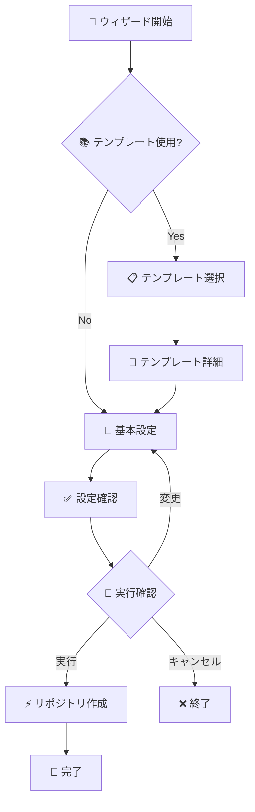

# gh-wizard 最終要件定義書

## 1. プロジェクト概要

### 1.1 プロジェクト名
**`gh-wizard`** - GitHub CLI拡張機能

### 1.2 コンセプト
「魔法のように簡単で直感的なGitHubリポジトリ作成ウィザード」

### 1.3 プロジェクトの目的
GitHub CLIを使ったリポジトリ作成を対話的で直感的にし、特にテンプレートリポジトリの選択と活用を魔法のように簡単にする。

### 1.4 ターゲットユーザー
- GitHub CLIを使う開発者（初心者〜上級者）
- テンプレートリポジトリを頻繁に使う開発者
- プロジェクト立ち上げを効率化したい開発者
- コマンドラインでの統合開発環境を構築したい開発者

### 1.5 既存ツールとの差別化
| 比較項目 | gh-wizard | gh-template | gh extension create |
|---------|-----------|-------------|---------------------|
| **用途** | 汎用リポジトリ作成 | テンプレート加工 | 拡張機能作成 |
| **UI** | リッチな対話UI | CLI引数のみ | 基本的な対話 |
| **テンプレート選択** | ビジュアル選択 | 手動指定 | なし |
| **統合性** | 作成〜開発開始まで | クローンのみ | 骨組み作成のみ |
| **対象レベル** | 全レベル | 中級者以上 | 拡張機能開発者 |

## 2. 機能要件

### 2.1 コア機能（MVP）

#### 2.1.1 ウィザード起動・ナビゲーション
- **FR-001**: `gh wizard` コマンドでウィザード起動
- **FR-002**: 直感的なキーボードナビゲーション（↑↓, Enter, Esc）
- **FR-003**: ステップバイステップのガイド表示
- **FR-004**: 進行状況インジケーター表示

#### 2.1.2 テンプレート選択機能
- **FR-005**: ログイン中ユーザーのテンプレートリポジトリ自動取得
- **FR-006**: テンプレートの美しいリスト表示（名前、説明、統計情報）
- **FR-007**: テンプレート詳細のプレビュー表示
- **FR-008**: 「テンプレートを使わない」オプション

#### 2.1.3 リポジトリ設定機能
- **FR-009**: リポジトリ名の入力・バリデーション
- **FR-010**: 説明文の入力（オプション）
- **FR-011**: 公開設定の選択（Public/Private）
- **FR-012**: クローン可否の選択
- **FR-013**: README追加可否の選択（テンプレート未使用時）

#### 2.1.4 確認・実行機能
- **FR-014**: 設定内容の美しい確認画面
- **FR-015**: 実行されるコマンドのプレビュー
- **FR-016**: 設定変更のオプション
- **FR-017**: GitHub CLI経由でのリポジトリ作成実行
- **FR-018**: 成功・失敗フィードバック

### 2.2 拡張機能（v1.1+）

#### 2.2.1 検索・フィルタリング
- **FR-019**: テンプレート名によるリアルタイム検索
- **FR-020**: 言語・カテゴリによるフィルタリング
- **FR-021**: 最近使用したテンプレートの履歴

#### 2.2.2 高度なプレビュー
- **FR-022**: テンプレートのREADME内容表示
- **FR-023**: ファイル構造のツリー表示
- **FR-024**: 統計情報（スター数、更新日時）の表示

#### 2.2.3 設定・カスタマイズ
- **FR-025**: ユーザー設定の永続化
- **FR-026**: デフォルト値の記憶機能
- **FR-027**: テーマ・カラーのカスタマイズ

### 2.3 未来の拡張（v2.0+）
- **FR-028**: 他ユーザー・Organizationのテンプレート検索
- **FR-029**: テンプレート変数の置換機能
- **FR-030**: Git設定の自動セットアップ

## 3. 非機能要件

### 3.1 パフォーマンス
- **NFR-001**: 起動時間2秒以内
- **NFR-002**: テンプレート一覧取得3秒以内
- **NFR-003**: UIレスポンス100ms以内
- **NFR-004**: メモリ使用量30MB以下

### 3.2 互換性・環境
- **NFR-005**: GitHub CLI v2.0+ 対応
- **NFR-006**: Go 1.19+ で動作
- **NFR-007**: macOS, Linux, Windows対応
- **NFR-008**: ターミナルサイズ 80x24 以上推奨

### 3.3 ユーザビリティ・品質
- **NFR-009**: 直感的で美しいTUIデザイン
- **NFR-010**: 分かりやすいエラーメッセージ
- **NFR-011**: 完全なキーボード操作
- **NFR-012**: アクセシビリティ対応（色盲対応等）

## 4. UI/UX設計詳細

### 4.1 ビジュアルアイデンティティ
```
🧙‍♂️ gh-wizard - GitHubリポジトリ作成ウィザード
```

### 4.2 画面フロー


### 4.3 詳細画面設計

#### 4.3.1 ウェルカム画面
```
┌─────────────────────────────────────────────────────────────────┐
│  🧙‍♂️ GitHub Repository Wizard                                     │
│                                                                 │
│  GitHubリポジトリを魔法のように簡単に作成します                    │
│                                                                 │
│  ? テンプレートリポジトリを使用しますか？                         │
│    ▸ はい - 既存のテンプレートから作成                           │
│      いいえ - 空のリポジトリを作成                               │
│                                                                 │
│  ⌨️  ↑↓: 選択  Enter: 決定  q: 終了                              │
└─────────────────────────────────────────────────────────────────┘
```

#### 4.3.2 テンプレート選択画面
```
┌─────────────────────────────────────────────────────────────────┐
│  📚 テンプレート選択 (3/3 件)                                    │
│                                                                 │
│  / で検索: _______________                                       │
│                                                                 │
│  ▸ 🟦 nextjs-starter              ⭐ 15  🍴 3   📝 TypeScript    │
│    📄 Next.js + TypeScript + Tailwind CSS starter              │
│                                                                 │
│    🟨 react-component             ⭐ 8   🍴 2   📝 JavaScript   │
│    📄 React component library template                         │
│                                                                 │
│    🟩 go-cli-tool                 ⭐ 5   🍴 1   📝 Go           │
│    📄 Go CLI application template with Cobra                   │
│                                                                 │
│  ┌─ Template Details ──────────────────────────────────────────┐ │
│  │ 📦 nextjs-starter                                          │ │
│  │ 📅 最終更新: 2 days ago                                     │ │
│  │ 📝 Next.js starter with modern tooling                     │ │
│  │                                                            │ │
│  │ 📁 ファイル構成:                                            │ │
│  │   ├── src/                                                 │ │
│  │   ├── public/                                              │ │
│  │   ├── package.json                                         │ │
│  │   └── README.md                                            │ │
│  └────────────────────────────────────────────────────────────┘ │
│                                                                 │
│  ⌨️  ↑↓: 選択  Enter: 決定  /: 検索  Esc: 戻る                  │
└─────────────────────────────────────────────────────────────────┘
```

#### 4.3.3 リポジトリ設定画面
```
┌─────────────────────────────────────────────────────────────────┐
│  📝 リポジトリ設定                                              │
│                                                                 │
│  📦 Repository name                                             │
│  my-awesome-project_                                            │
│                                                                 │
│  📄 Description (optional)                                      │
│  My awesome Next.js project_                                    │
│                                                                 │
│  🔒 Visibility                                                  │
│    ▸ 🔒 Private     🌐 Public                                  │
│                                                                 │
│  📥 Clone locally after creation                                │
│    ▸ ✅ Yes         ❌ No                                       │
│                                                                 │
│  📋 Add README (template not used only)                        │
│    ▸ ✅ Yes         ❌ No                                       │
│                                                                 │
│  ⌨️  Tab: 次の項目  Shift+Tab: 前の項目  Enter: 次へ             │
└─────────────────────────────────────────────────────────────────┘
```

#### 4.3.4 確認画面
```
┌─────────────────────────────────────────────────────────────────┐
│  ✅ 設定内容確認                                                │
│                                                                 │
│  📚 Template:    Yuki-Sakaguchi/nextjs-starter                 │
│  📦 Name:        my-awesome-project                             │
│  📄 Description: My awesome Next.js project                    │
│  🔒 Visibility:  Private                                        │
│  📥 Clone:       Yes                                            │
│                                                                 │
│  ┌─ 実行コマンド ────────────────────────────────────────────────┐ │
│  │ gh repo create my-awesome-project \                        │ │
│  │   --template Yuki-Sakaguchi/nextjs-starter \               │ │
│  │   --description "My awesome Next.js project" \             │ │
│  │   --private \                                               │ │
│  │   --clone                                                   │ │
│  └────────────────────────────────────────────────────────────┘ │
│                                                                 │
│  ? この内容で実行しますか？                                      │
│    ▸ 🚀 実行する                                                │
│      ⚙️  設定を変更                                             │
│      ❌ キャンセル                                               │
│                                                                 │
│  ⌨️  ↑↓: 選択  Enter: 決定  Esc: キャンセル                     │
└─────────────────────────────────────────────────────────────────┘
```

### 4.4 キーバインド設計

| キー | 動作 | 画面 |
|------|------|------|
| `↑` / `k` | 上へ移動 | 全画面 |
| `↓` / `j` | 下へ移動 | 全画面 |
| `Enter` | 決定・次へ | 全画面 |
| `Tab` | 次の項目 | 設定画面 |
| `Shift+Tab` | 前の項目 | 設定画面 |
| `/` | 検索モード | テンプレート選択 |
| `Esc` | 戻る・キャンセル | 全画面 |
| `?` | ヘルプ表示 | 全画面 |
| `q` | 終了 | 全画面 |
| `Ctrl+C` | 強制終了 | 全画面 |

## 5. 技術仕様

### 5.1 技術スタック

#### 5.1.1 言語・主要ライブラリ
```go
// 必須ライブラリ
github.com/charmbracelet/bubbletea  // TUIフレームワーク
github.com/charmbracelet/lipgloss   // スタイリング
github.com/charmbracelet/bubbles    // TUIコンポーネント
github.com/cli/go-gh/v2             // GitHub API クライアント

// 追加ライブラリ
github.com/spf13/cobra              // CLI引数解析
gopkg.in/yaml.v3                    // 設定ファイル
github.com/sahilm/fuzzy             // ファジー検索
```

### 5.2 アーキテクチャ設計

#### 5.2.1 プロジェクト構造
```
gh-wizard/
├── cmd/
│   └── root.go              # CLI設定・引数処理
├── internal/
│   ├── config/
│   │   ├── config.go        # 設定管理
│   │   └── defaults.go      # デフォルト値
│   ├── github/
│   │   ├── client.go        # GitHub APIクライアント
│   │   ├── templates.go     # テンプレート操作
│   │   └── repository.go    # リポジトリ操作
│   ├── models/
│   │   ├── wizard.go        # ウィザード状態管理
│   │   ├── template.go      # テンプレート情報
│   │   └── repository.go    # リポジトリ設定
│   ├── tui/
│   │   ├── app.go           # アプリケーションメイン
│   │   ├── styles.go        # スタイル・テーマ定義
│   │   ├── welcome.go       # ウェルカム画面
│   │   ├── template.go      # テンプレート選択画面
│   │   ├── settings.go      # リポジトリ設定画面
│   │   ├── confirmation.go  # 確認画面
│   │   └── components/      # 再利用可能コンポーネント
│   │       ├── list.go      # リストコンポーネント
│   │       ├── input.go     # 入力コンポーネント
│   │       └── progress.go  # プログレスバー
│   └── utils/
│       ├── validation.go    # バリデーション
│       └── cache.go         # キャッシュ管理
├── pkg/
│   └── wizard/
│       └── wizard.go        # 公開API
├── main.go                  # エントリーポイント
├── go.mod
├── go.sum
├── README.md
├── LICENSE
└── .github/
    └── workflows/
        └── release.yml      # リリース自動化
```

### 5.3 データモデル設計

#### 5.3.1 メインモデル
```go
// ウィザードの状態管理
type WizardState struct {
    CurrentStep    Step
    UseTemplate    bool
    SelectedTemplate *Template
    RepoConfig     *RepositoryConfig
    SearchQuery    string
    Templates      []Template
}

// テンプレート情報
type Template struct {
    ID          string    `json:"id"`
    Name        string    `json:"name"`
    FullName    string    `json:"full_name"`
    Owner       string    `json:"owner"`
    Description string    `json:"description"`
    Stars       int       `json:"stargazers_count"`
    Forks       int       `json:"forks_count"`
    Language    string    `json:"language"`
    UpdatedAt   time.Time `json:"updated_at"`
    IsTemplate  bool      `json:"is_template"`
    Private     bool      `json:"private"`
}

// リポジトリ設定
type RepositoryConfig struct {
    Name        string
    Description string
    IsPrivate   bool
    ShouldClone bool
    AddReadme   bool
}

// アプリケーション設定
type Config struct {
    DefaultPrivate   bool   `yaml:"default_private"`
    DefaultClone     bool   `yaml:"default_clone"`
    DefaultAddReadme bool   `yaml:"default_add_readme"`
    CacheTimeout     int    `yaml:"cache_timeout_minutes"`
    Theme           string  `yaml:"theme"`
    RecentTemplates []string `yaml:"recent_templates"`
}
```

### 5.4 状態管理・フロー

#### 5.4.1 ステップ定義
```go
type Step int

const (
    StepWelcome Step = iota
    StepTemplateSelection
    StepRepositorySettings
    StepConfirmation
    StepExecution
    StepCompleted
)
```

#### 5.4.2 Bubble Teaメッセージ設計
```go
type TemplateSelectedMsg struct{ Template Template }
type ConfigUpdatedMsg struct{ Config RepositoryConfig }
type ExecutionStartedMsg struct{}
type ExecutionCompletedMsg struct{ Success bool, Error error }
type SearchQueryChangedMsg struct{ Query string }
type StepChangedMsg struct{ Step Step }
```

## 6. エラーハンドリング・ロバストネス

### 6.1 エラー分類
```go
type WizardError struct {
    Code    ErrorCode
    Message string
    Cause   error
    Step    Step
    Retry   bool
}

type ErrorCode string

const (
    // システムエラー
    ErrGHNotInstalled    ErrorCode = "GH_NOT_INSTALLED"
    ErrGHNotAuthenticated         = "GH_NOT_AUTHENTICATED"
    ErrAPIRateLimit              = "API_RATE_LIMIT"
    ErrNetworkError              = "NETWORK_ERROR"
    
    // ユーザーエラー
    ErrInvalidRepoName           = "INVALID_REPO_NAME"
    ErrRepoAlreadyExists         = "REPO_ALREADY_EXISTS"
    ErrNoTemplatesFound          = "NO_TEMPLATES_FOUND"
    
    // アプリケーションエラー
    ErrConfigLoadFailed          = "CONFIG_LOAD_FAILED"
    ErrTUIInitFailed            = "TUI_INIT_FAILED"
)
```

### 6.2 回復戦略
- API制限：待機時間の表示＋リトライ
- ネットワークエラー：キャッシュからのフォールバック
- 無効な入力：リアルタイムバリデーション
- 権限エラー：分かりやすい解決手順の提示

## 7. テスト戦略

### 7.1 テスト分類

#### 7.1.1 単体テスト (80% カバレッジ目標)
- GitHub APIクライアント
- データモデルのバリデーション
- 設定管理機能
- ユーティリティ関数

#### 7.1.2 統合テスト
- GitHub API連携
- TUIコンポーネント間の連携
- エラーハンドリングフロー

#### 7.1.3 E2Eテスト
- 完全なウィザードフロー
- 各種エラーシナリオ
- パフォーマンステスト

### 7.2 テスト環境
```go
// モック用インターフェース
type GitHubClient interface {
    GetTemplateRepositories() ([]Template, error)
    CreateRepository(config RepositoryConfig) error
}

// テスト用モックデータ
var MockTemplates = []Template{
    {Name: "test-template", FullName: "user/test-template", ...},
}
```

## 8. 実装計画・マイルストーン

### 8.1 Phase 1: Core MVP (2週間)
**目標**: 基本的なウィザードフローの完成

#### Week 1: 基盤構築
- [ ] プロジェクト構造の構築
- [ ] GitHub APIクライアントの実装
- [ ] 基本データモデルの定義
- [ ] 設定管理システムの実装

#### Week 2: TUI基盤
- [ ] Bubble Teaアプリケーションの骨組み
- [ ] 基本的なナビゲーション
- [ ] ウェルカム画面の実装
- [ ] スタイルシステムの構築

### 8.2 Phase 2: コア機能実装 (2週間)

#### Week 3: テンプレート機能
- [ ] テンプレート選択画面の実装
- [ ] GitHub APIからのテンプレート取得
- [ ] テンプレート詳細表示
- [ ] 検索・フィルタリング機能

#### Week 4: 設定・実行機能
- [ ] リポジトリ設定画面の実装
- [ ] 確認画面の実装
- [ ] GitHub CLIとの連携
- [ ] エラーハンドリングの強化

### 8.3 Phase 3: 改善・リリース準備 (1週間)

#### Week 5: 品質向上
- [ ] テストの追加・強化
- [ ] パフォーマンス最適化
- [ ] ドキュメントの作成
- [ ] リリースの自動化

### 8.4 Phase 4: 公開・フィードバック (継続)
- [ ] GitHub拡張機能としての公開
- [ ] ユーザーフィードバックの収集
- [ ] バグ修正・改善
- [ ] 次期バージョンの企画

## 9. 成功指標・KPI

### 9.1 技術指標
- **パフォーマンス**: 起動2秒以内、レスポンス100ms以内
- **品質**: テストカバレッジ80%以上、リリース前のバグゼロ
- **安定性**: クラッシュ率0.1%以下

### 9.2 ユーザー指標
- **使いやすさ**: 初回使用でのタスク完了率90%以上
- **効率性**: 従来方法と比較して50%の時間短縮
- **満足度**: ユーザーレビュー平均4.5/5以上

### 9.3 採用指標
- **初期**: GitHub CLI拡張機能として100インストール/月
- **中期**: 1,000インストール/月、10+ GitHubスター
- **長期**: コミュニティでの言及、他ツールでの参照

## 10. 今後の展望・ロードマップ

### 10.1 v1.0 (MVP)
✅ 基本的なウィザードフロー  
✅ テンプレート選択・リポジトリ作成  
✅ 美しいTUI  

### 10.2 v1.1 (機能拡張)
🔄 高度な検索・フィルタリング  
🔄 設定の永続化  
🔄 パフォーマンス改善  

### 10.3 v1.5 (エコシステム拡張)
🔄 Organization テンプレート対応  
🔄 テンプレート変数の置換  
🔄 Git設定の自動化  

### 10.4 v2.0 (革新的機能)
🔮 AI による推奨テンプレート  
🔮 プロジェクト分析・最適化提案  
🔮 チーム向け機能  

## 11. 開発環境・ツール

### 11.1 必要な開発環境
```bash
# Go環境
go version go1.19+

# GitHub CLI
gh version 2.0+

# 開発ツール
make          # ビルド自動化
golangci-lint # リンター
gotestsum     # テストツール
```

### 11.2 推奨VS Code拡張機能
- Go (公式)
- GitHub Pull Requests and Issues
- GitLens
- Terminal

## 12. リリース・配布戦略

### 12.1 配布方法
1. **GitHub Releases**: バイナリ配布
2. **GitHub CLI**: `gh extension install Yuki-Sakaguchi/gh-wizard`
3. **Homebrew**: (将来的)

### 12.2 バージョニング
[Semantic Versioning](https://semver.org/) に準拠
- **Major**: 破壊的変更
- **Minor**: 新機能追加
- **Patch**: バグ修正

### 12.3 継続的な改善
- GitHub Issues での要望・バグ管理
- 定期的なユーザビリティテスト
- コミュニティフィードバックの積極的な取り込み

---

## 🚀 次のアクション

この要件定義書を基に、以下のステップで開発を開始できます：

1. **環境準備**: Go環境、必要ライブラリのセットアップ
2. **プロジェクト初期化**: ディレクトリ構造の作成
3. **Phase 1開始**: GitHub APIクライアントから実装開始

準備が整いましたら、どのステップから始めるかお聞かせください！ 🧙‍♂️✨